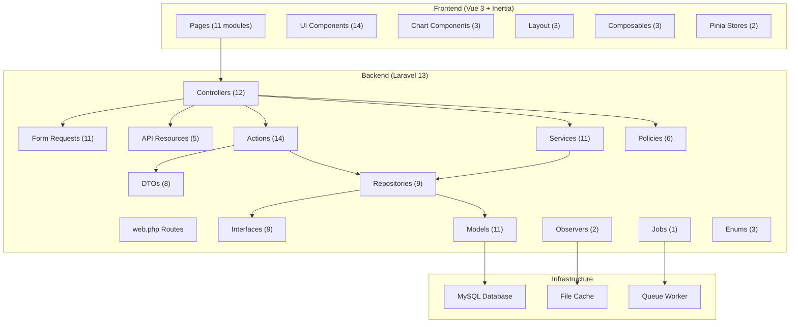

# Budget Monitoring V2 — Full-Stack Audit Report

**Date:** 2026-06-15  
**Stack:** Laravel 13 + Inertia.js v3 + Vue 3 + Tailwind v4 (MODE A)  
**Database:** MySQL (via WAMP)

---

## Executive Summary

The project demonstrates **strong architectural discipline** with a well-structured layered backend (Controllers → Actions → DTOs → Services → Repositories) and a modern frontend (Inertia + Vue 3 `<script setup>` + Pinia + Tailwind v4). Key strengths include explicit `$fillable`, SoftDeletes on auditable models, backed string enums, cursor-based pagination, cache versioning via observers, and proper resource transformers.

However, the audit identified **28 findings** across 5 severity levels. The most critical gaps are in **test coverage** (only ~30% of features covered), **missing authorization** on Debt/SavingsGoal controllers, and several **architecture layer violations** where services and controllers bypass the repository pattern.

---

## Audit Scorecard

| Category | Score | Grade |
|---|---|---|
| Architecture & Layering | 82/100 | B+ |
| Backend Code Quality | 85/100 | B+ |
| Frontend Code Quality | 75/100 | B |
| Data Optimization | 88/100 | A- |
| Security & Authorization | 70/100 | C+ |
| Test Coverage | 40/100 | D |
| Documentation | 60/100 | C |
| **Overall** | **72/100** | **B-** |

---

## 1. Architecture & Layering

### ✅ What's Good

- **Layered structure fully implemented:** `Controllers → Actions → DTOs → Services → Repositories → Models`
- **RepositoryServiceProvider** correctly binds all 9 interface→implementation pairs
- **DTOs** exist for all major features: Account, Transaction, BudgetGoal, Category, Person, RecurringTransaction, Debt, SavingsGoal
- **Actions** follow single-purpose pattern with `execute()` method (14 action classes across 7 features)
- **Explicit foreign keys** on all relationships in models ✅
- **Resources** (API transformers) used correctly — never returning raw models from controllers

### 🔴 Critical Findings

#### F-01: Direct Eloquent Queries in Controllers (Severity: HIGH)

[ReportController.php](file:///c:/wamp64/www/buget_monitoring-V2/app/Http/Controllers/ReportController.php) queries `Person::select(...)` directly in 4 places (lines 39, 52, 85, 99) instead of using `PersonRepositoryInterface`.

```php
// ❌ Lines 39, 52, 85, 99
'persons' => Person::select('id', 'name')->get(),

// ✅ Should use
'persons' => $this->personRepository->all_active(),
```

#### F-02: Direct Eloquent Query in DashboardService (Severity: HIGH)

[DashboardService.php](file:///c:/wamp64/www/buget_monitoring-V2/app/Services/DashboardService.php#L181) queries `Debt::where(...)` directly at line 181 instead of going through `DebtRepositoryInterface`.

```php
// ❌ Line 181
$activeDebtsQuery = Debt::where('status', 'active');

// ✅ Should use
$this->debtRepository->count_active($person_id);
```

#### F-03: Direct `Debt::findOrFail()` in Repository (Severity: MEDIUM)

[EloquentTransactionRepository.php](file:///c:/wamp64/www/buget_monitoring-V2/app/Repositories/EloquentTransactionRepository.php#L159) at lines 159 and 182 directly queries the `Debt` model. The repository should delegate Debt modifications to `DebtRepositoryInterface` or accept the Debt manipulation via events.

### 🟡 Minor Findings

#### F-04: ExportController Uses `paginate()` Instead of `cursorPaginate()` (Severity: LOW)

[ExportController.php](file:///c:/wamp64/www/buget_monitoring-V2/app/Http/Controllers/ExportController.php#L15) uses `->paginate(20)` at line 15. Per your rules, list endpoints on tables that could exceed 500 rows should use `cursorPaginate()`.

#### F-05: DebtService Missing Action Layer (Severity: LOW)

`DebtController` calls `$this->debtService->create(...)` directly — the Service class handles create/update/delete directly instead of routing through dedicated `CreateDebtAction`, `UpdateDebtAction`, `DeleteDebtAction` classes like other features.

#### F-06: CategoryController Bypasses Service Layer (Severity: LOW)

[CategoryController.php](file:///c:/wamp64/www/buget_monitoring-V2/app/Http/Controllers/CategoryController.php#L55-L66) calls `$this->categoryRepository->delete()` and `->update()` directly from the controller in `destroy()` and `toggle()` methods, bypassing the service layer.

---

## 2. Backend Code Quality

### ✅ What's Good

- **`declare(strict_types=1)`** present on virtually all PHP files
- **Backed string enums:** `TransactionType`, `CategoryType`, `RecurringFrequency`
- **Model `$casts`** properly configured with `decimal:2`, date, boolean, and enum casts
- **SoftDeletes** on Transaction, Account, Category, Person, Debt, RecurringTransaction
- **DB Transactions** wrap multi-write operations in `EloquentTransactionRepository` and `RecurringTransactionService`
- **Controller method length:** all under 20 lines ✅
- **No `dd()`, `dump()`, `var_dump()`, `ray()` in backend** ✅

### 🔴 Findings

#### F-07: Missing `declare(strict_types=1)` in Some Files (Severity: LOW)

Files missing `declare(strict_types=1)`:
- [Debt.php](file:///c:/wamp64/www/buget_monitoring-V2/app/Models/Debt.php) (model)
- [Export.php](file:///c:/wamp64/www/buget_monitoring-V2/app/Models/Export.php) (model)
- [User.php](file:///c:/wamp64/www/buget_monitoring-V2/app/Models/User.php) (model)
- [TransactionObserver.php](file:///c:/wamp64/www/buget_monitoring-V2/app/Observers/TransactionObserver.php)
- [AccountObserver.php](file:///c:/wamp64/www/buget_monitoring-V2/app/Observers/AccountObserver.php)
- [ExportController.php](file:///c:/wamp64/www/buget_monitoring-V2/app/Http/Controllers/ExportController.php)
- [ExportReportJob.php](file:///c:/wamp64/www/buget_monitoring-V2/app/Jobs/ExportReportJob.php)

#### F-08: Export Model Missing `$casts` (Severity: MEDIUM)

[Export.php](file:///c:/wamp64/www/buget_monitoring-V2/app/Models/Export.php) has no `$casts` array. Should cast `user_id` to integer at minimum. Also missing relationships (`belongsTo(User::class)`).

#### F-09: Debt Model Uses `'float'` Cast Instead of `'decimal:2'` (Severity: MEDIUM)

[Debt.php](file:///c:/wamp64/www/buget_monitoring-V2/app/Models/Debt.php#L23-L29) casts financial fields as `'float'` which can cause precision issues:

```php
// ❌ Current
'principal_amount' => 'float',
'interest_rate' => 'float',
'minimum_payment' => 'float',

// ✅ Should be
'principal_amount' => 'decimal:2',
'interest_rate' => 'decimal:2',
'minimum_payment' => 'decimal:2',
```

#### F-10: Missing `HasFactory` Trait on Models (Severity: LOW)

- `Debt` model missing `HasFactory` (no factory exists either)
- `BudgetGoal` model missing `HasFactory` (no factory exists either)
- `RecurringTransaction` model missing `HasFactory` (no factory exists either)
- `Export` model missing `HasFactory`

#### F-11: Test Scripts Left in Project Root (Severity: LOW)

Multiple test/debug scripts exist in the project root and should be removed:
- `test_forecast.php`, `test_nenia_forecast.php`, `test_nyla.php`, `test_nyla_charts.php`, `test_nyla_dashboard.php`, `test_nyla_data.php`, `test_ocr.js`, `test_recurring.php`, `test_recurring_owner.php`, `test_weekly.php`
- `ts_errors.txt`, `pint_results.txt`
- `eng.traineddata` (5.2 MB OCR training data — should be in `.gitignore` or downloaded at runtime)

#### F-12: Debt Model Missing `HasFactory`, Factory, and Seeder (Severity: MEDIUM)

No `DebtFactory`, `BudgetGoalFactory`, or `RecurringTransactionFactory` exist. Per rules, seeders + typed factories are required for every new model.

---

## 3. Security & Authorization

### ✅ What's Good

- **Policies exist** for Account, BudgetGoal, Category, Person, RecurringTransaction, Transaction (6 policies)
- **`$this->authorize()`** called on store/update/destroy in Account, BudgetGoal, Category, Person, RecurringTransaction, Transaction controllers
- **Form Requests** validate all mutative endpoints

### 🔴 Critical Findings

#### F-13: DebtController Missing Authorization (Severity: CRITICAL)

[DebtController.php](file:///c:/wamp64/www/buget_monitoring-V2/app/Http/Controllers/DebtController.php) has **no `$this->authorize()` calls** in `store()`, `update()`, or `destroy()` methods. No `DebtPolicy` exists either.

#### F-14: SavingsGoalController Missing Authorization (Severity: CRITICAL)

[SavingsGoalController.php](file:///c:/wamp64/www/buget_monitoring-V2/app/Http/Controllers/SavingsGoalController.php) has **no `$this->authorize()` calls** in any method. No `SavingsGoalPolicy` exists.

#### F-15: ExportController Missing Authorization (Severity: HIGH)

[ExportController.php](file:///c:/wamp64/www/buget_monitoring-V2/app/Http/Controllers/ExportController.php) has no authorization checks. Line 14 comment acknowledges multi-user concerns but doesn't implement protection: `// For simplicity, returning all exports.`

#### F-16: Export Fallback User ID (Severity: HIGH)

[ReportController.php](file:///c:/wamp64/www/buget_monitoring-V2/app/Http/Controllers/ReportController.php#L149):

```php
// ❌ Line 149 — hardcoded fallback user
'user_id' => $request->user()->id ?? 1,
```

This should fail explicitly if no user is authenticated rather than silently assigning user ID 1.

#### F-17: No Auth Middleware on Routes (Severity: HIGH)

[web.php](file:///c:/wamp64/www/buget_monitoring-V2/routes/web.php) has **no `auth` middleware** wrapping any routes. All endpoints are publicly accessible. While this may be intentional for a personal-use app, it violates security best practices.

---

## 4. Data Optimization

### ✅ What's Good

- **Cursor-based pagination** used in Transaction and Debt repositories ✅
- **`select()` with specific columns** in `EloquentTransactionRepository::paginate()` ✅
- **Eager loading with column specification** on relationships ✅
- **Whitelisted sort columns** in transaction repository ✅
- **No leading wildcard LIKE** — uses `$filters['search'].'%'` ✅
- **Database indexes** exist (2 migration files adding indexes on transactions)
- **Cache versioning** via observers on Transaction and Account mutations ✅
- **Cache::remember()** on all report/chart methods ✅

### 🟡 Findings

#### F-18: Missing Select Columns in Some Repository Methods (Severity: LOW)

Several repository methods use `->get()` without explicit `select()`:
- `calendar_transactions()` — line 343
- `split_transactions_raw()` — line 361
- `account_statement_raw()` — line 300

#### F-19: `ChartReportService::cashflow_projection()` Fetches All Active Accounts (Severity: LOW)

[ChartReportService.php](file:///c:/wamp64/www/buget_monitoring-V2/app/Services/ChartReportService.php#L455) line 455: `$this->accountRepository->all_active()->sum('current_balance')` loads all active accounts into memory just to sum balances. Should use a DB aggregate query.

---

## 5. Frontend Analysis

### ✅ What's Good

- **All components use `<script setup>`** (Composition API) ✅
- **TypeScript** used in composables and stores ✅
- **Pinia stores** with `$reset()` method defined ✅
- **`defineProps<{}>()` with TypeScript generics** used in most newer components ✅
- **Composables** follow `use` prefix convention (`useCurrency`, `useDate`, `useFlash`)
- **`Inertia::defer()`** used for expensive dashboard data ✅
- **Lazy page resolver** in `app.ts` ✅
- **Vite manualChunks** not configured (not optimal, but chunk warning limit raised to 1500)

### 🔴 Findings

#### F-20: SFC Size Violations (Severity: MEDIUM)

Per rules, total SFC should be ≤250 lines. The following pages significantly exceed this limit:

| File | Lines | Over Limit |
|---|---|---|
| Transactions/Index.vue | 543 | **+293 lines** |
| SavingsGoals/Index.vue | 492 | **+242 lines** |
| Recurring/Index.vue | 328 | **+78 lines** |
| Dashboard/Components/DashboardCharts.vue | 289 | +39 lines |
| Accounts/Index.vue | 274 | +24 lines |
| Calendar.vue | 260 | +10 lines |

> [!WARNING]
> `Transactions/Index.vue` (543 lines, 27KB) and `SavingsGoals/Index.vue` (492 lines, 24KB) urgently need decomposition into smaller components.

#### F-21: `console.log()` Left in Committed Code (Severity: MEDIUM)

[Transactions/Index.vue](file:///c:/wamp64/www/buget_monitoring-V2/resources/js/Pages/Transactions/Index.vue#L220), line 220:
```js
console.log("Found QR but not a valid BudgetMonitor payload", qrResult.data);
```

#### F-22: Mixed Props Declaration Styles (Severity: LOW)

Some pages use TypeScript generics (`defineProps<{}>()`) while others use runtime declarations (`defineProps({})`). Should standardize on TypeScript generics per rules.

**Runtime style (should migrate):**
- Transactions/Index.vue
- Reports/YearInReview.vue, Settlements.vue, IncomeExpense.vue, CategoryExpense.vue, Calendar.vue, BudgetGoal.vue, AccountStatement.vue
- Recurring/Index.vue, Persons/Index.vue, BudgetGoals/Index.vue, Categories/Index.vue, Accounts/Index.vue

**TypeScript generic style (correct):**
- SavingsGoals/Index.vue, Forecasting.vue, Downloads/Index.vue, Debts/Index.vue, Dashboard/Index.vue, Dashboard Components

#### F-23: No `manualChunks` Vendor Splitting (Severity: LOW)

[vite.config.js](file:///c:/wamp64/www/buget_monitoring-V2/vite.config.js) has `chunkSizeWarningLimit: 1500` which masks large bundles. Should configure `build.rollupOptions.output.manualChunks` to split vendor code (vue, pinia, chart.js, axios, dayjs).

---

## 6. Test Coverage

### ✅ What Exists

| Test File | Type | Coverage |
|---|---|---|
| AccountControllerTest.php | Feature | CRUD operations |
| PersonControllerTest.php | Feature | CRUD operations |
| ReportControllerTest.php | Feature | Basic endpoint tests |
| SavingsGoalControllerTest.php | Feature | Full CRUD + validation |
| AccountServiceTest.php | Unit | Service logic |
| PersonServiceTest.php | Unit | Service logic |
| TransactionServiceTest.php | Unit | Service logic |

### 🔴 Critical Gaps

#### F-24: Missing Tests (Severity: CRITICAL)

The following features have **zero test coverage**:

**Feature tests missing:**
- TransactionController (CRUD + filtering)
- BudgetGoalController
- CategoryController
- RecurringTransactionController
- DebtController
- SavingsGoalController (exists but no auth/policy tests)
- DashboardController
- ExportController

**Unit tests missing:**
- DashboardService
- BudgetGoalService
- RecurringTransactionService
- DebtService
- ChartReportService
- ReportService
- StatementReportService
- SavingsGoalService
- All Action classes (14 actions with 0 tests)

**Current coverage estimate: ~30% of business logic, ~25% of endpoints**

> [!CAUTION]
> The project's coding standards require ≥80% coverage on Action, Service, Repository classes. Current coverage is well below this threshold.

---

## 7. Missing Features per Standards

#### F-25: No API Resource for Debt, SavingsGoal, RecurringTransaction (Severity: MEDIUM)

Only 5 resource classes exist (Account, BudgetGoal, Category, Person, Transaction). Missing resources for:
- `DebtResource` — Debts returned as raw Eloquent models
- `SavingsGoalResource` — SavingsGoals returned as raw models with appended computed attributes
- `RecurringTransactionResource`

#### F-26: Missing Update Form Requests (Severity: LOW)

Most features use the same `Store*Request` for both create and update. While functional, per conventions the update requests should be separate:
- Missing: `UpdateAccountRequest`, `UpdateBudgetGoalRequest`, `UpdateCategoryRequest`, `UpdateTransactionRequest`, `UpdatePersonRequest`, `UpdateRecurringTransactionRequest`
- Correctly separate: `StoreDebtRequest` / `UpdateDebtRequest`, `StoreSavingsGoalRequest` / `UpdateSavingsGoalRequest`

#### F-27: No Frontend Tests (Severity: HIGH)

Zero Vue component tests exist. No Vitest setup, no `*.spec.ts` files. Rules require interaction tests for frontend components.

#### F-28: `useFlash.js` Should Be TypeScript (Severity: LOW)

[useFlash.js](file:///c:/wamp64/www/buget_monitoring-V2/resources/js/composables/useFlash.js) is the only `.js` composable — should be `.ts` for consistency.

---

## Prioritized Remediation Plan

### 🔴 Priority 1 — Critical (Do First)

| # | Finding | Effort |
|---|---|---|
| F-13 | Add `DebtPolicy` + authorization in `DebtController` | 30 min |
| F-14 | Add `SavingsGoalPolicy` + authorization in `SavingsGoalController` | 30 min |
| F-24 | Add feature tests for Transaction, BudgetGoal, Debt, RecurringTransaction controllers | 4-6 hrs |
| F-17 | Add `auth` middleware group to all routes (or document as intentionally public) | 15 min |

### 🟠 Priority 2 — High (Do Soon)

| # | Finding | Effort |
|---|---|---|
| F-01 | Replace `Person::select()` with repository calls in ReportController | 20 min |
| F-02 | Move `Debt::where()` in DashboardService to DebtRepository | 20 min |
| F-09 | Change Debt model casts from `float` to `decimal:2` | 10 min |
| F-15 | Add authorization to ExportController | 20 min |
| F-16 | Remove `?? 1` fallback user ID in export | 5 min |
| F-20 | Decompose oversized Vue SFCs (Transactions, SavingsGoals) | 3-4 hrs |
| F-21 | Remove `console.log()` from Transactions/Index.vue | 2 min |
| F-25 | Add DebtResource + SavingsGoalResource + RecurringTransactionResource | 1 hr |
| F-27 | Set up Vitest + basic component tests | 2-3 hrs |

### 🟡 Priority 3 — Medium (Next Sprint)

| # | Finding | Effort |
|---|---|---|
| F-03 | Decouple Debt manipulation from TransactionRepository | 1 hr |
| F-05 | Add CreateDebtAction, UpdateDebtAction, DeleteDebtAction | 45 min |
| F-06 | Route CategoryController through a CategoryService | 30 min |
| F-07 | Add `declare(strict_types=1)` to 7 files | 10 min |
| F-08 | Add $casts and relationship to Export model | 10 min |
| F-10 | Add `HasFactory` + factories for Debt, BudgetGoal, RecurringTransaction | 45 min |
| F-12 | Add DebtFactory, BudgetGoalFactory, RecurringTransactionFactory + seeders | 1 hr |
| F-22 | Standardize all defineProps to TypeScript generics | 1 hr |

### ⚪ Priority 4 — Low (Backlog)

| # | Finding | Effort |
|---|---|---|
| F-04 | Switch ExportController to cursorPaginate | 10 min |
| F-11 | Remove test scripts from project root | 5 min |
| F-18 | Add explicit select() to remaining repo methods | 30 min |
| F-19 | Replace in-memory sum with DB aggregate for total balance | 15 min |
| F-23 | Configure Vite manualChunks for vendor splitting | 15 min |
| F-26 | Create separate Update*Request classes | 1 hr |
| F-28 | Rename useFlash.js → useFlash.ts | 10 min |

---

## Architecture Diagram (Current)



---

## Files Inventory Summary

| Layer | Count | Notes |
|---|---|---|
| Models | 11 | All with explicit $fillable |
| Controllers | 12 | Thin, max ~20 lines/method |
| Actions | 14 | 7 features × 2 (create/update) + 1 delete |
| DTOs | 8 | Readonly, typed properties |
| Services | 11 | Business logic orchestration |
| Repositories | 9 | All implement interfaces |
| Interfaces | 9 | Full coverage |
| Form Requests | 11 | Validation + authorization |
| API Resources | 5 | ⚠️ Missing 3 (Debt, SavingsGoal, Recurring) |
| Policies | 6 | ⚠️ Missing 2 (Debt, SavingsGoal) |
| Observers | 2 | Cache busting |
| Enums | 3 | Backed string enums |
| Jobs | 1 | Export reports |
| Exports | 4 | Excel/PDF export classes |
| Vue Pages | 25 files | 11 modules |
| Vue Components | 20 files | UI + Charts + Layout |
| Composables | 3 | Currency, Date, Flash |
| Pinia Stores | 2 | Transaction, Account |
| Migrations | 23 | With indexes |
| Factories | 7 | ⚠️ Missing 3-4 |
| Seeders | 7 | Full seeding |
| Tests | 9 | ⚠️ ~30% coverage |
